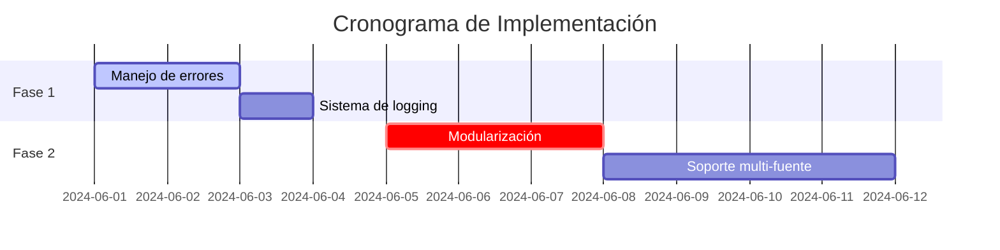

# 🗺️ Roadmap - Scraper de Noticias

## 📌 Fase 1: Estabilización (Sprint 1)
| ID  | Mejora                     | Prioridad | Tech Stack          | Estimación |
|-----|----------------------------|-----------|---------------------|------------|
| F1  | Manejo robusto de errores   | Crítica   | Python, logging     | 2 días     |
| F2  | Sistema de logging          | Alta      | logging, RotatingFileHandler | 1 día |
| F3  | Rotación de User-Agents     | Media     | fake-useragent      | 1 día      |

**Objetivo**: Garantizar que el scraper actual funcione sin fallos.

---

## 🚀 Fase 2: Escalabilidad (Sprint 2-3)
| ID  | Mejora                     | Prioridad | Tech Stack          | Estimación |
|-----|----------------------------|-----------|---------------------|------------|
| E1  | Modularización del código  | Alta      | Python (OOP)        | 3 días     |
| E2  | Soporte multi-fuente       | Alta      | BeautifulSoup       | 4 días     |
| E3  | Limitador de requests      | Media     | time, random        | 1 día      |

---

**Estructura propuesta**:

```bash
src/
├── scrapers/
│ ├── base_scraper.py # Clase abstracta
│ ├── aljazeera.py
│ └── bbc.py # Nuevo
```
---

## 🔥 Fase 3: Features Avanzados (Sprint 4-5)
| ID  | Mejora                     | Prioridad | Tech Stack          | Estimación |
|-----|----------------------------|-----------|---------------------|------------|
| A1  | Exportación a SQLite       | Media     | pandas, sqlite3     | 2 días     |
| A2  | API REST con FastAPI       | Baja      | FastAPI, Uvicorn    | 5 días     |
| A3  | Dashboard de resultados    | Baja      | Streamlit           | 3 días     |

---

## 📊 Fase 4: Monitoreo (Sprint 6+)
| M1  | Integración CI/CD          | Alta      | GitHub Actions      | 2 días     |
| M2  | Alertas por Telegram       | Media     | python-telegram-bot | 1 día      |

---

## 🛠️ Orden Recomendado de Implementación
1. **F1 → F2 → F3** *(Base estable)*  
2. **E1 → E2 → E3** *(Estructura escalable)*  
3. **A1 → M1** *(Persistencia + Automatización)*  
4. **A2 → A3** *(Interfaces avanzadas)*  



🔍 Cómo Contribuir
1. Asignarse a un issue con la etiqueta good first issue

2. Seguir el flujo estándar:

```bash
    git checkout -b feat/[ID]-descripción  # Ej: feat/F1-error-handling
    git commit -m "feat: [ID] Descripción" # Ej: "feat: F1 Implementa retry logic"
```